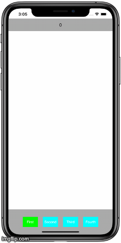

# CustomMenuDemo
The view that implements behavior of Menu with 4 items. Can be customized to SegmentControl appearence or CustomTabBar

### Usage:
* `code only (without StoryBoard)`
* `SnapKit`
* `Observer`
* `Custom UIView`
* `Delegate`
* `UIStakeView`

 
### Features: 
* Displays selected button in top UILabel

